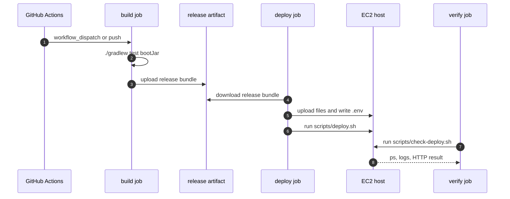
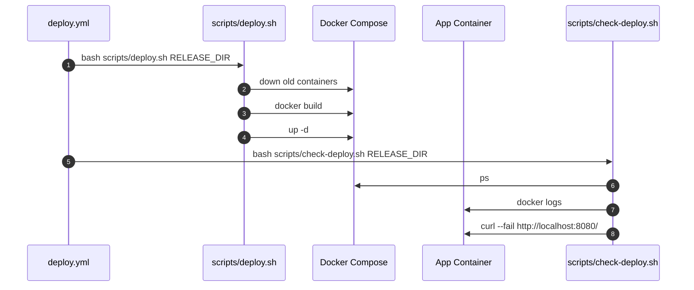
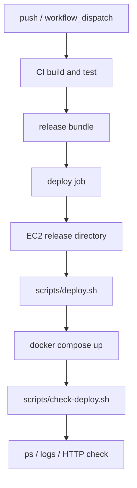

# 이론 정리

> 이번 시퀀스는 한 번 성공한 배포 흐름을 GitHub Actions workflow와 shell script로 반복 가능하게 고정하는 단계입니다.
> 이 브랜치에서는 완성된 CI, deploy workflow, `deploy.sh`, `check-deploy.sh`를 기준으로 build, deploy, verify가 어떤 순서와 실패 차단 기준을 갖는지 비교합니다.

## 1. Problem - 왜 운영 자동화가 필요한가

수동 배포는 작업자가 기억하는 순서에 의존합니다. 테스트를 빼먹거나, release bundle 구성을 틀리거나, 배포 후 로그 확인을 생략할 수 있습니다.

자동화의 목표는 단순히 배포를 빠르게 누르는 것이 아닙니다. 어떤 단계가 실패하면 다음 단계로 넘어가지 않게 만들고, 배포 성공 판정을 코드와 로그로 남기는 것입니다.

정답 구현은 아래 문제를 해결합니다.

- CI에서 build/test를 먼저 실행합니다.
- deploy workflow의 build job이 release bundle을 만듭니다.
- deploy job이 artifact를 받아 EC2에 업로드하고 `deploy.sh`를 실행합니다.
- verify job이 `check-deploy.sh`를 실행해 컨테이너 상태, 로그, HTTP 응답을 확인합니다.
- job 의존성으로 실패한 단계 이후 작업을 막습니다.

## 2. Analyze - 정답 구현에서 선택한 자동화 기준

| 기준 | 정답 구현의 선택 | 이유 |
|---|---|---|
| CI 기준 | `./gradlew test bootJar` | 배포 전 build/test를 고정합니다. |
| job 분리 | build, deploy, verify | 실패 위치와 책임을 분명히 합니다. |
| artifact | release bundle 업로드/다운로드 | build 결과를 deploy job에 전달합니다. |
| server script | `deploy.sh` | 서버 재배포 명령을 workflow에서 분리합니다. |
| verify script | `check-deploy.sh` | 배포 후 상태 확인을 별도 실패 기준으로 둡니다. |
| secrets | GitHub Secrets 참조 | 실제 비밀값을 코드에 남기지 않습니다. |

이 기준은 “배포 명령 실행”과 “서비스 정상 기동”을 분리합니다. deploy job이 끝났더라도 verify job이 실패하면 운영 성공으로 보지 않습니다.

## 3. API / 실행 시퀀스 다이어그램

### 3.1 build -> deploy -> verify 흐름

정답 workflow는 `needs`로 job 순서를 고정합니다. build가 실패하면 deploy는 실행되지 않고, deploy가 실패하면 verify는 실행되지 않습니다.

### 3.2 deploy script와 verify script 책임 분리

deploy script는 새 버전을 띄우는 책임이고, verify script는 띄운 뒤 실제 응답을 확인하는 책임입니다.

## 4. 계층 / DTO / 메시지 흐름

이번 시퀀스는 API DTO보다 workflow artifact, secret 이름, shell argument가 메시지 역할을 합니다. 그래서 DTO 흐름은 “자동화 단계 사이에 어떤 산출물과 값이 전달되는가”로 읽습니다.

### 4.1 자동화 계층 흐름

| 계층 | 정답 구현에서 확인할 책임 | 주요 파일 |
|---|---|---|
| CI | 코드가 빌드되고 테스트되는지 확인합니다. | `.github/workflows/ci.yml` |
| Artifact | 배포에 필요한 파일 묶음을 전달합니다. | release bundle |
| Deploy | 서버에 파일을 올리고 재배포를 실행합니다. | `.github/workflows/deploy.yml`, `scripts/deploy.sh` |
| Verify | 배포 후 상태와 HTTP 응답을 확인합니다. | `scripts/check-deploy.sh` |
| Secrets | 서버 접속과 운영 설정 값을 주입합니다. | `secrets.*` 참조 |

### 4.2 자동화 메시지 흐름

| 메시지/산출물 | 출발 | 도착 | 정답 구현에서 확인할 점 |
|---|---|---|---|
| jar | build job | release bundle | `build/libs/*.jar`가 `app.jar`로 복사됩니다. |
| deploy files | build job | EC2 release directory | Dockerfile, deploy, scripts가 함께 업로드됩니다. |
| artifact | build job | deploy job | `upload-artifact`와 `download-artifact`가 연결됩니다. |
| `.env` 내용 | GitHub Secrets | EC2 `.env` | 운영 값은 workflow에서 서버 파일로 씁니다. |
| `RELEASE_DIR` | workflow env | scripts | 작업 디렉터리를 통일합니다. |
| verify result | EC2 app | verify job | `curl --fail` 실패가 workflow 실패가 됩니다. |

## 5. Action - 정답 구현에서 비교할 코드 흐름

### 5.1 CI workflow

`ci.yml`은 build와 test를 먼저 고정합니다.

비교 포인트:

- PR과 push에서 실행 조건이 명확한가요?
- JDK 21 설정과 Gradle 실행 권한이 준비되나요?
- `./gradlew test bootJar`가 실패하면 workflow가 실패하나요?

### 5.2 Deploy workflow

`deploy.yml`은 build, deploy, verify job을 나눕니다. build job은 release bundle을 만들고, deploy job은 EC2에 업로드하며, verify job은 배포 결과를 확인합니다.

비교 포인트:

- release bundle에 jar, Dockerfile, env 예시, deploy 디렉터리, scripts가 들어가나요?
- artifact가 build job에서 deploy job으로 전달되나요?
- deploy job이 `.env`를 Secrets 기반으로 만들고 `deploy.sh`를 실행하나요?
- verify job이 `check-deploy.sh`를 별도로 실행하나요?

### 5.3 운영 scripts

`deploy.sh`와 `check-deploy.sh`는 서버에서 실행할 명령을 분리합니다.

비교 포인트:

- `deploy.sh`는 기존 컨테이너 정리, image build, compose up만 담당하나요?
- `check-deploy.sh`는 compose ps, logs, HTTP 응답 확인을 담당하나요?
- 두 script 모두 `set -euo pipefail`로 실패를 숨기지 않나요?

## 6. Result - 확인할 결과와 남은 한계

정답 구현 기준으로 아래를 확인합니다.

- CI가 build/test를 먼저 실행합니다.
- deploy workflow가 build, deploy, verify job을 분리합니다.
- artifact로 release bundle이 job 사이를 이동합니다.
- deploy script와 verify script 책임이 분리되어 있습니다.
- verify HTTP check 실패는 workflow 실패로 이어집니다.

남는 한계도 함께 봅니다.

- 실제 EC2, GitHub Secrets, 네트워크 환경은 로컬에서 완전히 검증하기 어렵습니다.
- rollback, blue-green, canary 같은 고급 배포 전략은 이번 범위가 아닙니다.
- root path `http://localhost:8080/` 검증은 최소 기준이며, 운영에서는 별도 health endpoint가 더 적합할 수 있습니다.

## 7. 실무 포인트

- 자동화는 빠른 실행보다 실패를 멈추는 기준이 더 중요합니다.
- workflow job은 실패 지점을 찾기 쉽도록 책임을 나누는 편이 좋습니다.
- artifact는 build 결과를 deploy job에 전달하는 계약입니다.
- script에는 서버에서 반복 실행할 명령을 두고, workflow에는 순서와 secret 전달을 둡니다.
- verify는 container 상태뿐 아니라 애플리케이션 응답까지 확인해야 합니다.
- secret 값은 로그에 나오지 않게 하고, workflow에는 secret 이름만 남깁니다.

## 8. 용어 정리

### CI

- 뜻
  변경된 코드가 빌드되고 테스트되는지 자동으로 확인하는 흐름입니다.
- 왜 중요한가
  깨진 코드가 배포 단계로 넘어가는 것을 막습니다.
- 이번 코드에서는 어디에 보이는가
  `.github/workflows/ci.yml`
- 짧은 상황 예시
  PR이나 push에서 `./gradlew test bootJar`가 실패하면 배포 전 단계에서 멈춥니다.

### CD

- 뜻
  검증된 결과물을 실행 환경으로 전달하고 배포하는 흐름입니다.
- 왜 중요한가
  사람이 매번 같은 서버 명령을 손으로 반복하지 않게 합니다.
- 이번 코드에서는 어디에 보이는가
  `.github/workflows/deploy.yml`, `scripts/deploy.sh`
- 짧은 상황 예시
  release bundle을 EC2에 올리고 compose로 앱을 다시 띄웁니다.

### Artifact

- 뜻
  build 결과물과 배포에 필요한 파일을 묶은 산출물입니다.
- 왜 중요한가
  build job의 결과를 deploy job이 같은 기준으로 사용할 수 있습니다.
- 이번 코드에서는 어디에 보이는가
  `actions/upload-artifact`, `actions/download-artifact`
- 짧은 상황 예시
  jar, Dockerfile, deploy 디렉터리, scripts를 release bundle로 묶습니다.

### Verify

- 뜻
  배포 후 서비스가 실제로 살아 있는지 확인하는 단계입니다.
- 왜 중요한가
  배포 명령 종료와 서비스 정상 동작은 다른 기준이기 때문입니다.
- 이번 코드에서는 어디에 보이는가
  `scripts/check-deploy.sh`, verify job
- 짧은 상황 예시
  `curl --fail --silent http://localhost:8080/`가 실패하면 verify job이 실패합니다.

### Secret

- 뜻
  코드에 직접 쓰면 안 되는 운영 비밀값입니다.
- 왜 중요한가
  SSH key, DB password, JWT secret 같은 값이 Git에 남으면 보안 사고로 이어질 수 있습니다.
- 이번 코드에서는 어디에 보이는가
  `${{ secrets.EC2_SSH_KEY }}`, `${{ secrets.PROD_DB_PASSWORD }}`
- 짧은 상황 예시
  workflow에는 값 자체가 아니라 secret 이름만 남깁니다.

## 9. 다음 구현으로 연결되는 지점

`docs/answer-guide.md`를 볼 때는 YAML 문법보다 job 의존성, artifact 전달, deploy/verify script 책임 분리를 먼저 확인합니다. 다음 리팩토링 시퀀스에서는 자동화가 지켜주는 build/test 기준을 바탕으로 코드 구조를 더 읽기 좋게 다룹니다.

멘토용 설명 포인트

- starter와 비교할 때 YAML 문법보다 job 의존성과 실패 차단 지점을 먼저 설명하게 합니다.
- deploy와 verify를 나눈 이유를 운영 성공 판정 기준으로 연결합니다.
- secret 값 자체가 아니라 secret 이름과 주입 위치만 확인하게 합니다.
- verify가 실패하는 상황을 일부러 상상하게 해서 자동화의 성공 기준을 설명하게 합니다.

