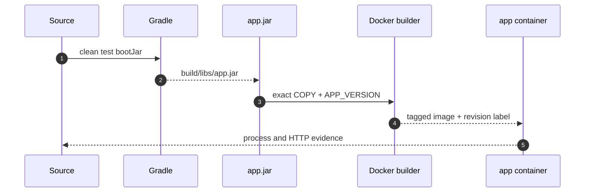
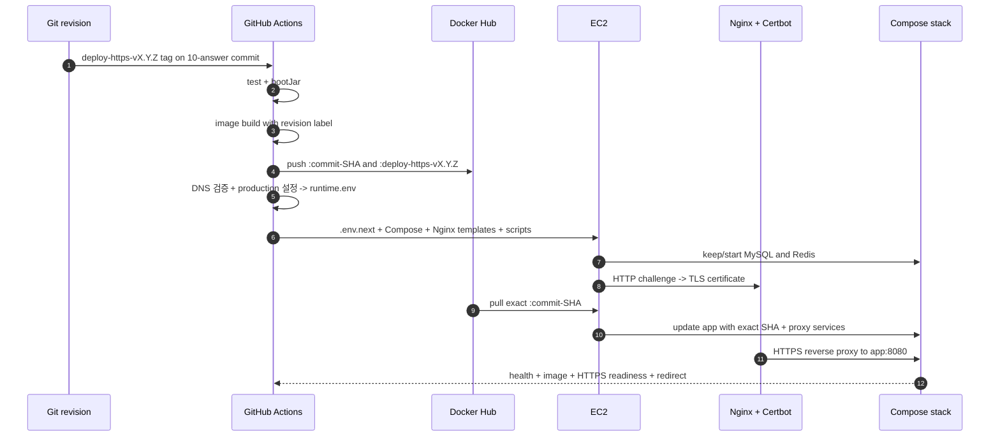

# Docker Runtime과 CI/CD 이론 정리

로컬에서 실행되는 source는 그대로 배포 단위가 되지 않습니다.
이번 랩은 검증된 source를 실행 가능한 JAR로 만들고, 같은 JAR를 담은 이미지를 Docker Hub를 통해 EC2까지 전달한 뒤 Nginx HTTPS 경계에서 실제 실행 결과를 확인합니다.

<a id="seq-09"></a>

## 09. 재현 가능한 실행 단위를 만듭니다

`09-answer`는 `deploy-v1.0.3` HTTP 배포를 재현하는 불변 기준입니다.
Spring Boot의 `8080`을 직접 공개하는 이 상태를 보존하고 HTTPS 변경은 `10-answer`에만 누적합니다.



| 단계 | 들어온 것 | 한 일 | 나간 것 또는 상태 |
| --- | --- | --- | --- |
| 1 | source와 test | `clean test bootJar` 실행 | 검증된 `app.jar` |
| 2 | `app.jar`와 Dockerfile | exact COPY와 revision label 기록 | tagged image |
| 3 | image와 runtime `.env` | Compose로 app process 시작 | running 또는 기동 실패 |
| 4 | 실행 중인 app | container와 HTTP 상태 확인 | runtime 성공 또는 첫 실패 경계 |

### JAR 이름은 하나로 고정합니다

Spring Boot 프로젝트는 executable JAR와 plain JAR가 함께 생길 수 있습니다.
Dockerfile이 wildcard로 두 파일 중 하나를 우연히 고르면 build 결과를 재현하기 어렵습니다.

이 레포는 다음 계약을 사용합니다.

- `bootJar` 결과는 `build/libs/app.jar`입니다.
- plain `jar` task는 비활성화합니다.
- Dockerfile은 `build/libs/app.jar`만 복사합니다.
- `.dockerignore`는 다른 build 결과를 제외하되 `app.jar`는 context에 포함합니다.

```text
source -> test -> build/libs/app.jar -> Dockerfile COPY -> image
```

JAR 파일명이 바뀌거나 파일이 없으면 Docker build가 바로 실패하므로 잘못된 산출물이 다음 단계로 넘어가지 않습니다.

### image에는 source revision을 남깁니다

Docker tag만으로는 컨테이너 안의 코드가 어느 commit에서 만들어졌는지 증명하기 어렵습니다.
그래서 image build 시 `APP_VERSION`을 전달하고 OCI label에 기록합니다.

```dockerfile
ARG APP_VERSION=local
LABEL org.opencontainers.image.revision="${APP_VERSION}"
COPY build/libs/app.jar /app/app.jar
```

로컬에서는 `local`, GitHub Actions에서는 `${GITHUB_SHA}`가 revision이 됩니다.
배포 검증은 tag뿐 아니라 이 label도 확인합니다.

### image와 runtime config의 책임은 다릅니다

image에는 실행 코드와 Java runtime을 넣습니다.
DB 비밀번호, JWT secret, OAuth client secret 같은 환경별 값은 image에 넣지 않고 Compose와 `.env`로 주입합니다.

| 구분 | 저장할 것 | 저장하지 않을 것 |
| --- | --- | --- |
| Docker image | `app.jar`, Java runtime, ENTRYPOINT, revision label | 운영 비밀번호와 token |
| Compose | service 관계, port, environment 변수 이름 | 실제 secret 값 |
| GitHub `production` Environment | 운영 DB, JWT, OAuth, Mail 값과 10의 도메인·인증서 연락처 | source와 JAR |
| EC2 `.env` | Actions가 전달한 현재 runtime 값 | source, JAR, GitHub token |

Actions는 개별 Secret과 Variable을 로그에 출력하지 않고 runtime `.env`로 조립합니다.
검증된 파일만 EC2의 `.env.next`로 전송하고 권한을 `600`으로 제한한 뒤 기존 `.env`와 원자적으로 교체합니다.

[main Visual Lab에서 runtime 경계를 확인하기](https://github.com/stdiodh/spring-boot-deployment-runtime-lab/tree/main/docs/visual-lab/sequences/09)

<a id="seq-10"></a>

## 10. 같은 image를 HTTPS 경계까지 배포합니다

EC2에서 JAR를 받아 image를 다시 만들면 Actions가 검증한 결과와 서버가 실행한 결과 사이에 새 build가 생깁니다.
이번 랩은 Actions가 image를 한 번만 만들고 Docker Hub가 그 image를 전달하며, Nginx와 Certbot이 공개 HTTPS 경계를 담당하도록 책임을 나눕니다.



| 단계 | 들어온 것 | 한 일 | 나간 것 또는 상태 |
| --- | --- | --- | --- |
| 1 | source와 commit SHA | test, `bootJar`, image build | 검증된 SHA image |
| 2 | SHA image | Docker Hub에 SHA와 배포 tag push | registry 배포 입력 |
| 3 | SHA tag, 도메인과 production runtime | DNS 확인, 인증서 bootstrap, exact pull, Compose 기동 | HTTPS runtime stack |
| 4 | 실행 중인 stack | health, image, revision, HTTPS readiness와 redirect 검증 | workflow 성공 또는 실패 |

### SHA tag가 배포 버전입니다

workflow는 annotated tag가 가리키는 commit을 40자리 release SHA로 해석합니다.
Actions는 같은 image에 두 tag를 게시합니다.

| tag | 용도 |
| --- | --- |
| tag 대상 commit SHA | 실제 배포와 검증에 사용하는 불변 식별자 |
| `deploy-https-vX.Y.Z` | 사람이 HTTPS 배포 이력을 찾는 불변 release 별칭 |

배포 tag는 이미 원격에 게시한 뒤 이동하거나 재사용하지 않습니다.
EC2 배포 입력은 항상 40자리 commit SHA image입니다.
이미 게시된 SHA image는 revision label을 확인해 재사용하고 workflow에서 덮어쓰지 않습니다.
배포 script는 SHA tag를 정확히 pull하고, verify job은 컨테이너의 image reference, revision label과 HTTPS readiness 응답을 확인합니다.

### gate는 실패 이후 단계를 닫습니다

```text
test + bootJar
  -> image publish
  -> EC2 deploy
  -> runtime verify
```

- test 또는 `bootJar`가 실패하면 image를 게시하지 않습니다.
- image 게시가 실패하면 SSH 배포를 시작하지 않습니다.
- deploy가 실패하면 verify를 시작하지 않습니다.
- image, 인증서 또는 HTTPS 검증이 실패하면 workflow 전체를 성공으로 판정하지 않습니다.

`needs`는 job 순서를 고정하고, deployment concurrency는 두 운영 배포가 동시에 EC2를 바꾸지 못하게 합니다.

### 첫 배포는 HTTPS 경계를 만들고 이후에는 필요한 서비스만 갱신합니다

MySQL과 Redis는 장기 상태 서비스이고 app은 commit마다 교체되는 배포 서비스입니다.
10의 배포는 전체 Compose stack을 내리지 않습니다.

```text
docker compose up -d --no-recreate mysql redis
certificate check -> HTTP challenge Nginx -> Certbot when needed
docker compose pull app
docker compose up -d --no-deps --force-recreate app nginx
docker compose up -d --no-deps certbot
```

실제 script는 Compose가 SHA image를 해석하도록 값을 export한 뒤 상태 서비스는 보존하고 공개 경계만 갱신합니다.

```bash
export APP_IMAGE
docker compose --env-file .env -f deploy/compose.prod.yaml up -d --no-recreate mysql redis
# 인증서가 usable하지 않을 때 HTTP challenge Nginx와 Certbot을 먼저 실행합니다.
docker compose --env-file .env -f deploy/compose.prod.yaml pull app
docker compose --env-file .env -f deploy/compose.prod.yaml up -d --no-deps --force-recreate app
docker compose --env-file .env -f deploy/compose.prod.yaml up -d --no-deps --force-recreate nginx
docker compose --env-file .env -f deploy/compose.prod.yaml up -d --no-deps certbot
```

기존 MySQL과 Redis container가 있으면 다시 만들지 않고, 없거나 멈춘 서비스는 기동합니다.
그 뒤 새 app image와 공개 경계만 갱신하므로 MySQL volume과 기존 데이터는 유지됩니다.
첫 배포에서는 workflow가 `.env`를 전달하므로 EC2에 runtime 값을 미리 작성할 필요가 없습니다.
MySQL, Redis와 app은 Compose 내부 network에서 연결하므로 host의 `3306`, `6379`, `8080`을 공개하지 않습니다.

### HTTP bootstrap 뒤 HTTPS로 전환합니다

Compose는 `nginx:1.28.3-alpine`과 `certbot/certbot:v5.7.0`을 고정해서 사용합니다.
인증서가 없거나 24시간 안에 만료되거나 정상 PEM이 아니면 Nginx를 HTTP challenge template로 먼저 띄우고 Certbot webroot 방식으로 발급 또는 갱신합니다.
발급 뒤 Nginx를 HTTPS template로 다시 만들며 `80` 요청은 `443`으로 이동하고 `443` 요청은 `app:8080`으로 전달됩니다.

Certbot은 12시간마다 인증서 갱신을 시도하고 Nginx는 6시간마다 reload하여 갱신된 인증서를 반영합니다.
Nginx는 `X-Forwarded-*`와 WebSocket의 `Upgrade`, `Connection` header를 전달합니다.
Spring Boot는 forwarded header를 해석하므로 프록시 뒤에서도 원래 HTTPS 요청 정보를 사용합니다.

### 성공 판정에는 실행 증거가 필요합니다

배포 명령이 종료됐다는 사실과 서비스가 정상이라는 사실은 다릅니다.
workflow의 verify job은 다음 순서로 확인합니다.

1. 선언된 image reference가 요청한 SHA tag인지 확인합니다.
2. OCI revision label이 `${GITHUB_SHA}`와 같은지 확인합니다.
3. MySQL, Redis, Nginx가 healthy이고 Certbot이 running인지 확인합니다.
4. 제한된 횟수 안에 `https://<APP_DOMAIN>/actuator/health/readiness` 응답이 오는지 확인합니다.
5. `http://<APP_DOMAIN>/` 요청이 같은 도메인의 HTTPS URL로 이동하는지 확인합니다.

내부 검증이나 GitHub runner의 외부 HTTPS readiness가 실패하면 이전 bundle, runtime 환경과 image를 복원하고 이전 HTTP 또는 HTTPS readiness를 다시 확인합니다. 시도한 workflow는 rollback 성공 여부와 무관하게 실패로 남습니다.
이후 이력상 rollback 배포가 필요하면 HTTPS workflow가 있는 정상 commit에 새로운 `deploy-https-vX.Y.Z` tag를 만들어 같은 gate를 다시 통과시킵니다.

### secret은 사용 위치에 따라 나눕니다

| 위치 | 값 | 이유 |
| --- | --- | --- |
| Repository Secrets | Docker Hub 계정/token, EC2 host/user/key | image 게시와 원격 접속에 필요 |
| `production` Secrets | DB, JWT, Mail, Google client secret | 민감한 runtime 값 |
| `production` Variables | DB 사용자/이름, Google client ID, `PROD_DOMAIN`, `PROD_CERTBOT_EMAIL`, 공개 URL | 민감하지 않은 runtime 값 |
| EC2 `.env` | Actions가 위 값을 Compose 입력으로 조립한 결과 | 실행 중인 container에 주입 |

Secret은 workflow 명령문에 직접 넣지 않고 step 환경변수로 전달합니다.
Actions는 필수값과 dotenv 형식을 확인하고, 값 자체를 출력하지 않은 채 `.env.next`를 전송합니다.
EC2에서 Compose 설정이 유효할 때만 기존 `.env`를 백업하고 교체합니다.
publish job은 두 Nginx template을 실제 `nginx -t`로 검사합니다. EC2 staging은 필수 파일, shell 문법과 Compose 설정을 확인하고, 완성된 이전 bundle snapshot을 보존해 application과 ingress를 같은 기준으로 rollback합니다.

### production trigger는 10-answer의 배포 tag입니다

`main`은 가이드 브랜치이고 `09-answer`는 `deploy-v1.0.3` HTTP 기준, 실제 HTTPS 실행 기준은 `10-answer`입니다.
HTTPS 전용 `deploy-https-vX.Y.Z` 형식은 09의 구 HTTP tag workflow와 실행 경로를 분리합니다.
문서나 일반 commit push만으로 EC2가 바뀌지 않으며, 규칙에 맞는 annotated deploy tag를 push해야 배포가 시작됩니다.
workflow는 tag commit이 `origin/10-answer`에 포함되는지도 publish 전에 확인합니다.

## 09와 10 연결

`09-answer`에서 다음 HTTP runtime 계약을 확인합니다.

- `build/libs/app.jar` 생성 계약
- Dockerfile과 `.dockerignore`
- `application-prod.yaml`
- `deploy/compose.prod.yaml`
- GitHub `production` Secret/Variable 계약
- Docker와 Docker Compose가 설치된 EC2

`10-answer`는 이 기준 위에 Nginx, Certbot, 도메인 DNS, forwarded/WebSocket header, HTTPS readiness와 tag rollback을 추가합니다.

## 남은 범위

이번 랩은 공개 Docker Hub 저장소, 단일 EC2, Docker Compose를 기준으로 합니다.
private registry 인증, Blue-Green, Canary, Kubernetes, Terraform, observability와 알림은 후속 운영 주제입니다.

[main Visual Lab에서 CI/CD gate를 확인하기](https://github.com/stdiodh/spring-boot-deployment-runtime-lab/tree/main/docs/visual-lab/sequences/10)
