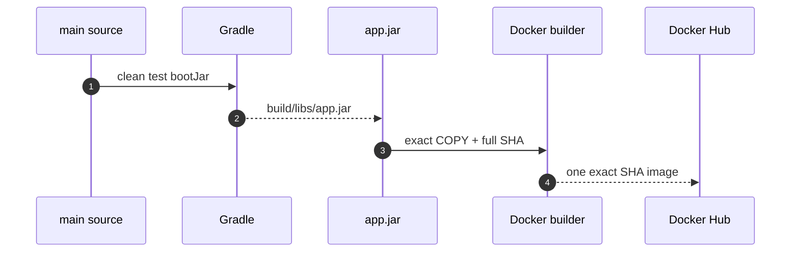
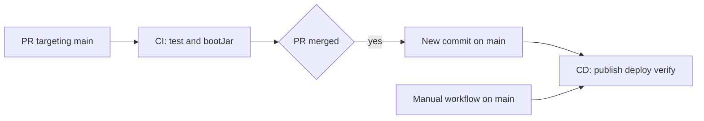
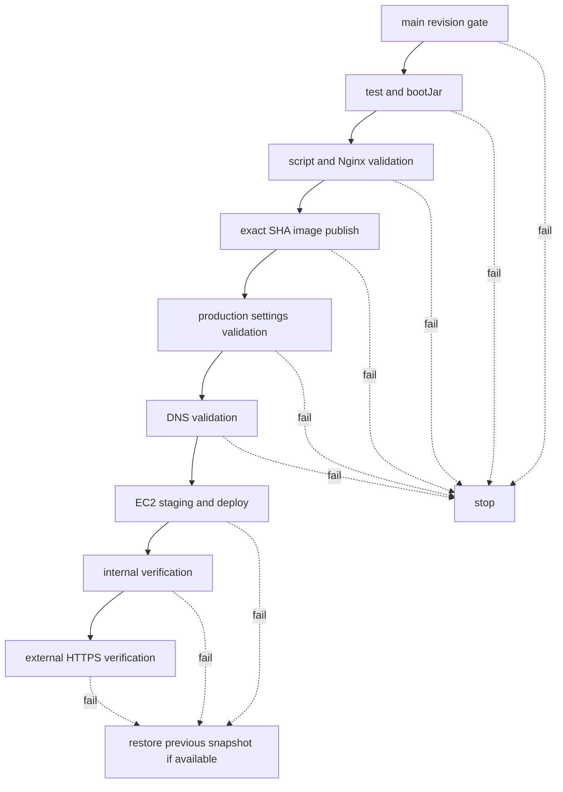
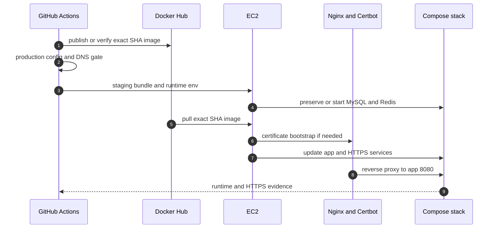

# CI/CD와 HTTPS 운영 배포 이론

<a id="seq-10"></a>

로컬에서 실행되는 source 자체는 운영 배포 단위가 아닙니다.
이번 랩은 `main`의 검증된 source를 실행 가능한 JAR로 만들고, 같은 JAR를 담은 불변 Docker 이미지를 Docker Hub를 통해 EC2에 전달한 뒤 HTTPS 경계에서 실행 증거를 확인합니다.

## 1. 재현 가능한 artifact를 만듭니다



| 단계 | 입력 | 검증 또는 변환 | 출력 |
| --- | --- | --- | --- |
| 1 | source와 test | `clean test bootJar` | 검증된 `app.jar` |
| 2 | `app.jar`, Dockerfile, full SHA | exact COPY와 OCI label 기록 | 불변 image |
| 3 | image와 Docker Hub 경로 | 기존 artifact 검증 또는 새 artifact 게시 | exact SHA image |

### 실행 JAR 이름을 하나로 고정합니다

Spring Boot 프로젝트는 executable JAR와 plain JAR가 함께 생길 수 있습니다.
Dockerfile이 wildcard로 둘 중 하나를 우연히 선택하면 같은 source에서도 다른 runtime artifact가 만들어질 수 있습니다.

이 저장소의 계약은 다음과 같습니다.

- `bootJar` 결과는 `build/libs/app.jar`입니다.
- plain `jar` task는 비활성화합니다.
- Dockerfile은 `build/libs/app.jar`만 복사합니다.
- `.dockerignore`는 다른 build 결과를 제외하되 `app.jar`는 context에 포함합니다.

JAR가 없거나 이름이 바뀌면 image build가 즉시 실패하므로 잘못된 artifact가 다음 단계로 이동하지 않습니다.

### 이미지 안에 source revision을 기록합니다

Docker 이미지 경로만 보아서는 컨테이너 안의 코드가 어느 commit에서 만들어졌는지 충분히 증명할 수 없습니다.
그래서 build 시 같은 full SHA를 두 argument로 전달합니다.

```dockerfile
ARG APP_VERSION=local
ARG APP_RELEASE=local
LABEL org.opencontainers.image.revision="${APP_VERSION}"
LABEL org.opencontainers.image.version="${APP_RELEASE}"
```

운영 build에서는 `APP_VERSION`과 `APP_RELEASE`가 모두 `GITHUB_SHA`입니다.
`org.opencontainers.image.revision`은 실행 revision 검증의 기준입니다.

## 2. `main`은 유일한 운영 source입니다

이 저장소는 여러 단계용 정답 브랜치를 겹쳐 관리하지 않습니다.
독립 저장소의 `main`이 코드 검토와 운영 배포의 유일한 기준입니다.



PR 단계의 CI는 Docker Hub push나 EC2 접속을 하지 않습니다.
운영 Secret 없이 source와 JAR 계약만 검증하므로 외부 기여자의 PR도 운영 자격 증명과 분리됩니다.

CD는 다음 두 경로에서 시작됩니다.

- `main`에 새 commit이 push된 경우
- 사용자가 `workflow_dispatch`에서 `main`을 실행한 경우

수동 실행은 최초 포크 배포나 현재 `main` 재배포에 사용합니다.
첫 배포 이후 일반 변경은 PR 검증을 거쳐 `main`에 merge하면 자동으로 배포됩니다.

### publish 전에 원격 `main`과 exact SHA를 맞춥니다

workflow event에 SHA가 있다고 해서 그 revision이 현재 원격 `main`이라는 보장은 충분하지 않습니다.
오래 대기한 실행이나 잘못 선택한 ref가 artifact를 게시하지 않도록 publish 전에 다음 gate를 둡니다.

```text
GITHUB_SHA matches ^[0-9a-f]{40}$
GITHUB_SHA == fetched origin/main
```

둘 중 하나라도 실패하면 image build와 push가 열리지 않습니다.
이 gate는 “어떤 source가 artifact를 만들 자격이 있는가”를 명확히 합니다.

## 3. full SHA image 하나만 운영 artifact입니다

운영 이미지 경로는 다음 형식입니다.

```text
docker.io/${DOCKERHUB_USERNAME}/aandi-cicd-deployment-lab:<full-sha>
```

콜론 뒤의 full SHA는 Docker 이미지 태그이며 Git 태그가 아닙니다.
Git 이력을 따로 표시하는 이름을 만들지 않아도 commit SHA 자체로 source와 image를 연결할 수 있습니다.

같은 image에 사람이 읽기 쉬운 별칭을 더하면 별칭이 가리키는 artifact가 바뀔 수 있습니다.
이번 랩은 그 모호함을 없애기 위해 full SHA 이미지 하나만 게시하고 EC2도 그 경로만 pull합니다.

### 기존 SHA image는 검증한 뒤 재사용합니다

동일한 SHA의 workflow를 다시 실행했을 때 registry에 이미지가 이미 있을 수 있습니다.
이 경우 workflow는 해당 경로를 덮어쓰지 않고 이미지를 pull한 뒤 다음 값을 확인합니다.

```text
org.opencontainers.image.revision == GITHUB_SHA
```

값이 다르면 registry의 이름과 artifact 내용이 충돌한 것이므로 배포를 중단합니다.
값이 같을 때만 이미 검증된 artifact를 재사용합니다.
이미지가 없을 때만 `APP_VERSION`과 `APP_RELEASE`를 같은 SHA로 build하고 정확히 한 경로를 push합니다.

## 4. gate는 실패 이후 단계를 닫습니다



`publish -> deploy -> verify`는 앞 단계가 성공해야 다음 단계가 실행됩니다.
운영 배포 concurrency도 한 번에 하나만 실행되므로 두 revision이 같은 EC2를 동시에 갱신하지 않습니다.

성공은 workflow step이 끝났다는 사실만으로 정하지 않습니다.
실제 runtime에서 다음 증거를 확인해야 합니다.

- app, MySQL, Redis와 Nginx의 기대 상태
- Certbot process 상태
- app container의 image reference와 image ID
- image의 OCI revision
- HTTPS readiness 응답
- HTTP에서 같은 도메인의 HTTPS URL로 이동하는 응답

## 5. image와 runtime config의 책임을 분리합니다

image에는 실행 코드와 Java runtime만 넣습니다.
DB 비밀번호, JWT secret, OAuth secret 같은 환경별 값은 image에 포함하지 않습니다.

| 경계 | 저장할 것 | 저장하지 않을 것 |
| --- | --- | --- |
| Docker image | `app.jar`, Java runtime, entrypoint, revision label | 운영 비밀번호와 token |
| Compose | service 관계, port, 환경변수 이름 | 실제 secret 값 |
| Repository Secrets | Docker Hub와 EC2 접속 정보 | 애플리케이션 runtime source |
| `production` Environment | DB, JWT, Mail, OAuth, 도메인, 인증서 연락처 | source와 JAR |
| EC2 `.env` | 현재 runtime 값과 exact image 경로 | GitHub token, source, JAR |

Actions는 production 값을 로그에 출력하지 않고 runtime `.env`로 조립합니다.
검증된 파일만 EC2로 전송하고 권한을 `600`으로 제한합니다.

### 포크는 설정과 인프라 소유권을 상속하지 않습니다

GitHub는 보안을 위해 원본 저장소의 Secret을 포크에 복사하지 않습니다.
`production` Environment의 Secret·Variable도 새 포크에 자동으로 생기지 않습니다.
포크의 Actions 실행도 최초에 사용자가 허용해야 할 수 있습니다.

따라서 포크 소유자는 다음 경계를 모두 직접 소유해야 합니다.

- Docker Hub 계정과 `aandi-cicd-deployment-lab` 저장소
- EC2 인스턴스와 SSH key
- DNS를 변경할 수 있는 운영 도메인
- Repository Secrets
- `production` Environment의 Secrets와 Variables

원본 저장소 소유자의 Docker Hub, EC2 또는 도메인을 입력하면 타인의 운영 환경을 변경할 수 있으므로 사용하지 않습니다.

## 6. HTTPS runtime 경계를 만듭니다

EC2에서 JAR를 받아 image를 다시 만들면 Actions가 검증한 artifact와 서버가 실행한 artifact 사이에 새 build가 생깁니다.
이번 랩은 Actions에서 image를 한 번만 만들고, EC2에서는 exact SHA image를 pull해 실행합니다.



10은 기존 HTTPS runtime의 DB와 인증서를 이어받기 위해 `aandi-*` 자원 이름을 유지합니다.
09가 별도 `aandi-runtime-*` namespace를 사용하므로 두 저장소는 같은 EC2에서도 충돌하지 않습니다.

| 종류 | 계약 |
| --- | --- |
| release directory | `/home/<EC2_USERNAME>/aandi-cicd-deployment-lab` |
| Compose project | `aandi-production` |
| containers | `aandi-app`, `aandi-nginx`, `aandi-certbot`, `aandi-mysql`, `aandi-redis` |
| volumes | `aandi-mysql-data`, `aandi-certbot-www`, `aandi-letsencrypt` |

app은 host port를 열지 않고 Compose network의 `8080`에서만 요청을 받습니다.
Nginx만 host의 `80`, `443`을 사용합니다.
MySQL `3306`과 Redis `6379`도 외부에 공개하지 않습니다.

### DNS는 인증서와 외부 검증의 입력입니다

인증서 발급 서버와 GitHub runner는 공개 DNS를 통해 EC2에 접근합니다.
그래서 운영 도메인의 모든 A 레코드가 `EC2_HOST`와 같은 public IPv4를 가리켜야 합니다.
AAAA 레코드가 남아 있으면 일부 요청이 준비되지 않은 IPv6 주소로 갈 수 있으므로 허용하지 않습니다.

인증서가 없거나 손상되었거나 24시간 안에 만료되면 HTTP challenge용 Nginx를 먼저 실행합니다.
Certbot이 인증서를 준비한 뒤 HTTPS template로 전환하며, 일반 HTTP 요청은 HTTPS로 이동합니다.

## 7. rollback은 snapshot 복구와 이력 복구로 나뉩니다

배포 script는 새 bundle을 staging 영역에서 검증합니다.
현재 배포가 있다면 Compose·Nginx template·script, `.env`와 image 정보를 직전 snapshot으로 보존한 뒤 새 파일을 설치합니다.
배포 또는 검증이 실패하면 workflow는 이 snapshot을 이용해 이전 runtime과 readiness를 복구합니다.

그러나 최초 배포에는 직전 snapshot이 없습니다.
따라서 최초 실행이 중간에 실패하면 자동 복구가 불가능할 수 있습니다.
이 경우 로그의 첫 실패 원인을 고친 뒤 현재 `main`을 다시 실행합니다.

이미 운영에 반영된 잘못된 변경을 이력에서 되돌릴 때는 문제 commit을 지우거나 이동하지 않습니다.
`git revert <bad-sha>`가 만드는 새 commit을 `main`에 push하면 새 SHA image가 만들어지고 정상 CD 흐름으로 배포됩니다.

이 방식은 “현재 운영 상태가 왜 바뀌었는가”를 Git 이력과 Docker image SHA로 함께 추적할 수 있게 합니다.

## 8. 이번 랩의 책임 경계

이번 랩이 직접 다루는 범위는 다음과 같습니다.

- `main` 대상 PR CI
- `main` push 자동 CD와 `workflow_dispatch`
- exact SHA image 게시와 OCI revision 검증
- GitHub 설정에서 runtime `.env` 생성
- DNS gate, Nginx, Certbot HTTPS 경계
- EC2 staging, 배포, 실행 증거 확인과 가능한 자동 복구
- revert commit을 통한 수동 복구

무중단 다중 인스턴스 배포, managed database, private registry 인증, secret manager, blue-green routing과 관측성 플랫폼은 후속 운영 범위입니다.

[Visual Lab에서 전체 경계 확인하기](./visual-lab/index.html)
