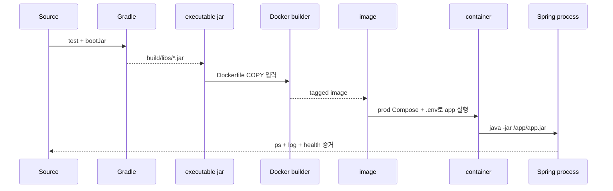
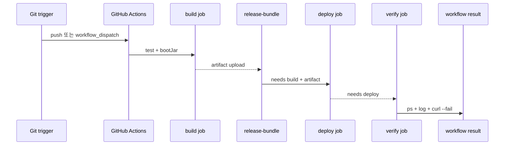

# Docker/Runtime과 CI/CD 이론 정리

로컬에서 `bootRun`이 성공해도 운영 서버의 실행이 보장되지는 않습니다.
배포는 source를 복사하는 일이 아니라 검증된 artifact, 실행 환경, runtime 증거를 이어 붙이는 일입니다.

<a id="seq-09"></a>

## 09. source가 실행 중인 process가 되기까지

실습 시작 상태의 `Dockerfile`, `application-prod.yaml`, 운영 Compose에는 COPY·ENTRYPOINT와 환경 변수 연결을 채우는 TODO가 남아 있습니다. 아래 예시는 이 TODO가 도달해야 할 가이드 형태입니다. 다만 현재 `.dockerignore`가 `build` 전체를 제외하므로 `bootJar`가 만든 `build/libs/*.jar`도 Docker build context에 들어가지 않습니다. Dockerfile만 완성해도 image가 만들어진다고 해석하면 안 됩니다.

### 실행 단위는 단계마다 달라집니다

1. source에서 테스트를 실행합니다.
2. 테스트를 통과한 source를 `bootJar`로 executable jar로 바꿉니다.
3. Dockerfile은 jar를 image 안의 `app.jar`로 복사하고 실행 명령을 고정합니다.
4. Compose가 image에서 container instance를 만듭니다.
5. container의 `ENTRYPOINT`가 Spring process를 시작합니다.
6. `docker compose ps`, application log, HTTP 응답으로 실제 실행 상태를 확인합니다.



| 단계 | 들어온 것 | 한 일 | 나간 것 또는 상태 |
|---|---|---|---|
| 1 | source와 test | 동작을 검증 | 통과한 build 입력 |
| 2 | 통과한 source | `bootJar` 실행 | `build/libs/*.jar` |
| 3 | jar와 Dockerfile | jar를 image filesystem에 복사 | image layer |
| 4 | image build context | `ENTRYPOINT`를 포함한 image 생성 | tagged image |
| 5 | image와 runtime config | container instance 생성 | container created |
| 6 | container | `java -jar` 실행 | Spring process 시작 시도 |
| 7 | process 상태 | ps·log·HTTP 증거 확인 | healthy 또는 첫 실패 경계 |

jar와 image는 실행 전 artifact이고, container와 process는 실행 중 상태입니다.

### Dockerfile은 jar를 실행 단위로 바꿉니다

source 전체가 아니라 `bootJar` 결과를 image에 넣습니다.

```dockerfile
FROM eclipse-temurin:21-jre
WORKDIR /app
ARG JAR_FILE=build/libs/*.jar
COPY ${JAR_FILE} app.jar
EXPOSE 8080
ENTRYPOINT ["java", "-jar", "/app/app.jar"]
```

실행 전에는 jar가 filesystem artifact로만 존재하고, image 생성 뒤에는 같은 jar와 Java 실행 명령이 하나의 배포 입력으로 묶입니다.

### 첫 실패 경계에서 멈춥니다

- 테스트가 실패하면 jar, image, container 단계로 범위를 넓히지 않습니다.
- 실제 jar 위치와 `COPY` source가 다르면 image가 만들어지지 않습니다.
- 필수 환경변수가 빠지면 container 명령이 끝나도 Spring process가 시작하지 못할 수 있습니다.
- container가 created 또는 running으로 보여도 application log와 HTTP health가 없으면 서비스 성공으로 판정하지 않습니다.

```bash
./gradlew test bootJar
sed -n '1,120p' .dockerignore
docker build -t aandi-deployment-runtime-lab:latest .
cp .env.example .env
docker compose --env-file .env -f deploy/compose.prod.yaml up -d
docker compose --env-file .env -f deploy/compose.prod.yaml ps
docker logs --tail 50 aandi-app
```

두 번째 명령의 출력에서 `build` 규칙을 직접 확인할 수 있습니다. 이 규칙은 `build/libs/*.jar`까지 build context에서 제외하므로 세 번째 Docker build가 `COPY source not found` 경계에서 실패합니다. `.dockerignore`에서 jar 경로를 다시 포함하거나 build 제외 정책을 조정한 뒤에만 뒤의 실행 검증으로 넘어갈 수 있습니다. `.env`의 placeholder도 실제 로컬 검증 값으로 채워야 합니다. 기본 `compose.yaml`은 MySQL과 Redis만 올리므로 app container 검증에는 같은 `:latest` tag를 참조하는 운영 Compose 파일을 명시해야 합니다.

[Visual Lab에서 입력 조건을 보고 경로 예측하기](./visual-lab/sequences/09/)

<a id="seq-10"></a>

## 10. build, deploy, verify를 서로 다른 gate로 봅니다

현재 가이드 workflow는 test, bundle, upload, EC2 실행과 로그 확인을 하나의 `deploy` job에서 순서대로 수행합니다. 이번 실습 시작 상태는 이를 `build`, `deploy`, `verify` job과 두 script로 나눌 뼈대를 제공하지만 각 본문은 TODO입니다. 아래 diagram과 표는 그 TODO가 지향하는 gate 모델이며, 아직 실행 증거가 나온 완성 pipeline을 묘사하지 않습니다.

또한 현재 가이드와 완성 예시의 원격 `.env` 작성 구간은 중첩 heredoc 종료자 `ENV` 앞에 공백이 남습니다. POSIX shell은 들여쓰기된 종료자를 닫는 표식으로 읽지 않으므로 뒤의 `deploy.sh` 호출까지 `.env` 내용으로 삼킬 수 있습니다. 종료자를 들여쓰기 없이 전달하거나 `printf` 방식으로 바꾸기 전에는 deploy·verify가 재현됐다고 판정하지 않습니다.

### 자동화는 성공 판정 기준을 고정합니다

수동 배포에서는 사람이 artifact 전달, 서버 갱신, 상태 확인 순서를 기억해야 합니다.
Pipeline은 `build -> deploy -> verify`의 `needs` 관계로 이전 gate를 통과한 경우에만 다음 job을 엽니다.



| 단계 | 들어온 것 | 한 일 | 나간 것 또는 상태 |
|---|---|---|---|
| 1 | Git trigger | workflow 시작 조건 확인 | build job 실행 |
| 2 | source | test와 `bootJar` 실행 | 검증된 jar 또는 build failure |
| 3 | jar와 배포 파일 | release bundle 업로드 | deploy 입력 artifact |
| 4 | build 통과 artifact | EC2 전송과 deploy script 실행 | app container 갱신 또는 deploy failure |
| 5 | deploy 통과 상태 | verify script 실행 | ps·log·HTTP 증거 |
| 6 | `curl --fail` 결과 | 성공 조건 판정 | workflow success 또는 verify failure |

배포 명령이 끝난 상태와 사용 가능한 서비스가 확인된 상태는 다릅니다.

### job 의존성은 실패 확산을 막습니다

```yaml
verify:
  runs-on: ubuntu-latest
  needs: deploy
  env:
    RELEASE_DIR: /home/${{ secrets.EC2_USERNAME }}/aandi-deployment-runtime-lab
  steps:
    - name: Verify deployment on EC2
      run: |
        # TODO 8. EC2에서 check-deploy.sh를 실행하세요.
```

위 코드는 실습 시작 파일의 실제 verify 뼈대입니다. 완성 조건은 TODO를 채워 build 실패가 deploy를 막고 deploy 실패가 verify를 막게 하는 것입니다. 시작 상태의 job 이름과 `needs`만으로 artifact 전달이나 서버 검증까지 성공했다고 판단하지 않습니다.

### 실패 원인은 최초 gate에서 읽습니다

- test 또는 `bootJar`가 실패하면 release bundle이 없고 deploy는 열리지 않습니다.
- artifact가 있어도 EC2 전송이나 `deploy.sh`가 실패하면 verify로 넘어가지 않습니다.
- 원격 `.env` heredoc이 닫히지 않으면 `deploy.sh`가 실행되지 않은 지점이 현재 저장소의 첫 deploy blocker입니다.
- app 갱신 명령이 끝나도 `docker compose ps`, log 또는 `curl --fail`이 실패하면 배포 완료가 아닙니다.
- workflow YAML과 repository에는 `${{ secrets.* }}` reference만 남깁니다. 실행 시 shell은 실제 secret 값을 펼쳐 EC2의 `.env` 파일에 기록합니다.
- 현재 workflow에는 원격 `.env`를 만든 뒤 `chmod`, `chown`, restrictive `umask`로 권한을 강화하는 단계가 없습니다. reference 사용과 원격 파일 보호를 같은 보장으로 보지 않습니다.

## 다음 질문

이 흐름은 기본 Docker Compose 배포와 검증까지 다룹니다.
Rollback, 무중단 배포, observability, 알림은 실패 상태를 더 안전하게 복구하고 설명하기 위한 후속 운영 주제입니다.

[Visual Lab에서 입력 조건을 보고 경로 예측하기](./visual-lab/sequences/10/)
